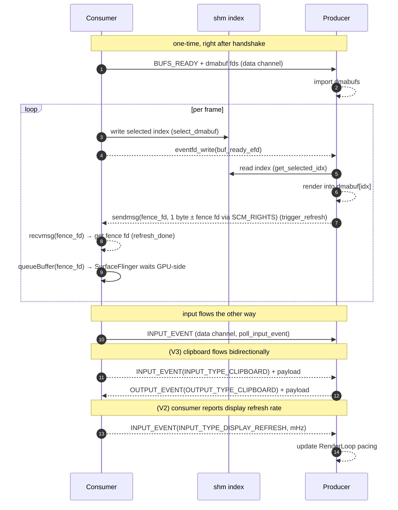
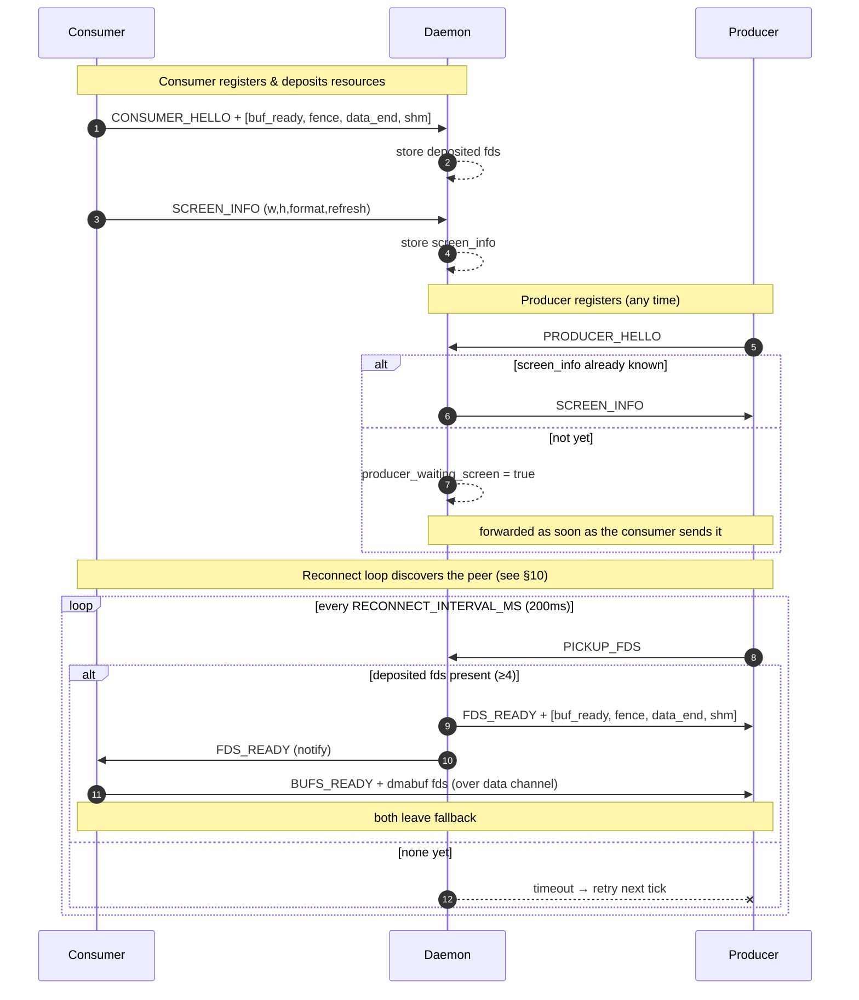
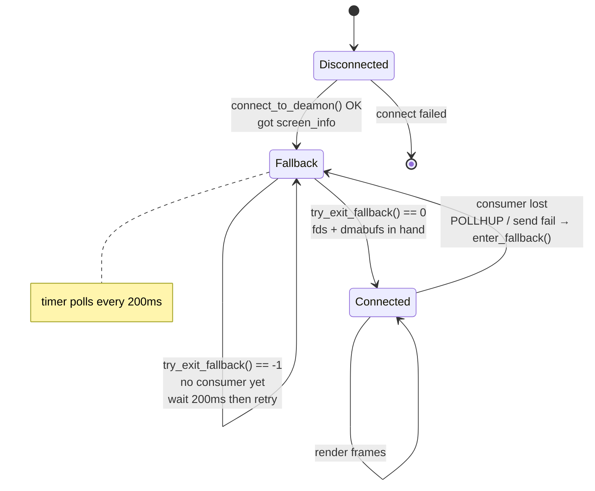
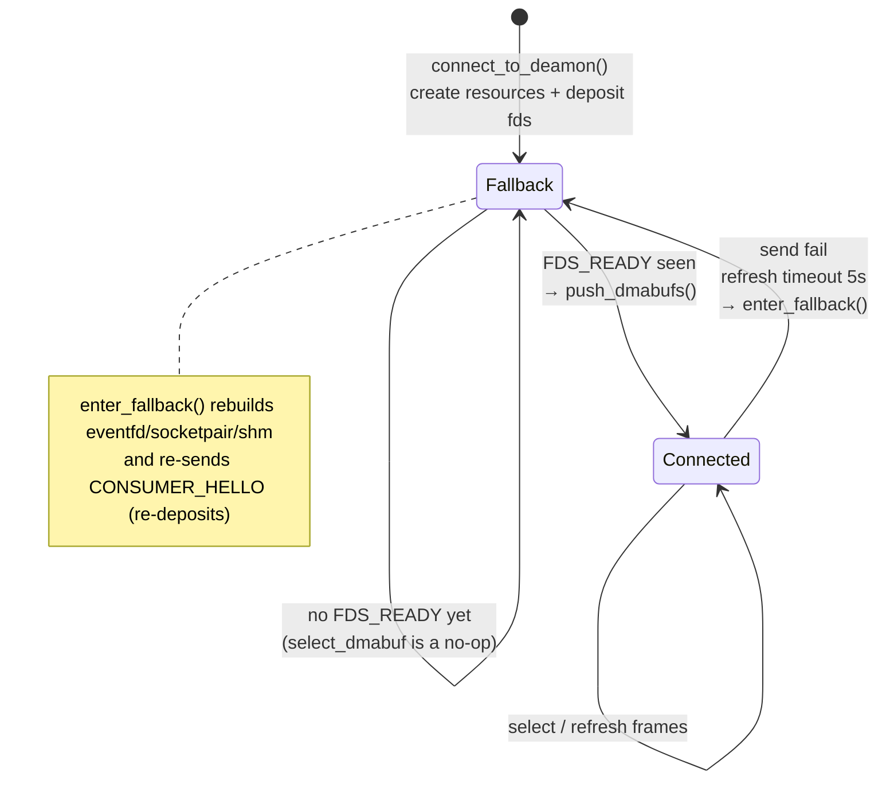

# anland-bridge

面向 **Droidspaces + Arch Linux + ANiri** 的 Android 显示、输入、剪贴板与硬件 H.264 编码桥。

本仓库保留 anland 的 daemon、producer/consumer 库和 Android consumer，并在 Android v5 consumer 中加入一条专用于标准 RDP 客户端的本地桥接路径：ANiri 直接渲染到 `MediaCodec` input Surface，由 Android 硬件编码器输出 H.264，再交给容器内的 `lamco-anland-bridge` 封装为 RDP EGFX AVC420。

> 本仓库不是 RDP 服务端。Windows `mstsc` 应连接配套的 `lamco-anland-bridge`，而不是直接连接 Android 服务。

## 与上游仓库的关系

| 仓库 | 关系 |
|---|---|
| [`superturtlee/anland`](https://github.com/superturtlee/anland) | 本仓库的实际代码来源，提供 Android 与 Linux 合成器之间的缓冲区共享协议、daemon、producer/consumer 和示例后端 |
| `collegeming/anland-bridge` | 在 anland 基础上继续维护 Android consumer、可靠数据通道、双向剪贴板和本地 RDP 硬件编码桥 |

由于仓库曾删除后重新创建，GitHub 当前没有显示 `Forked from superturtlee/anland` 的 `parent` 元数据；本 README 明确记录实际继承关系。本项目对 anland 通用协议的修改与 Android/RDP 场景扩展会尽量分层，避免把标准 RDP 逻辑耦合进基础 daemon。

## 改造背景

目标环境是一台 Android 手机：

- 使用 **Droidspaces** 运行 Arch Linux 容器；
- 容器内运行带 anland 后端的 **ANiri/niri**；
- Android consumer 分配 dmabuf，ANiri 通过 EGL 直接把 Linux 桌面渲染进去；
- 用户需要从 Windows PC 远程访问这个 Linux 桌面，同时保留键盘、鼠标、滚轮、剪贴板和 niri 快捷键。

传统做法通常需要 Portal、PipeWire、screencopy 或软件 H.264 编码。这会产生额外捕获、复制和 CPU 编码开销，也可能误传整个 Android 屏幕。当前方案要求：

1. **只编码 ANiri/anland 桌面**，不使用 Android `MediaProjection`；
2. ANiri 直接渲染到 Android `MediaCodec` Surface，避免额外桌面捕获链路；
3. 仅选择硬件 H.264 encoder，不回退到 OpenH264 等软件编码；
4. 输入直接写入 anland data socket，不经过 Android framework 的按键分发；
5. PC 的 Win/Super 键保持原值，使 `Win+E`、`Win+T` 能作为 niri `Mod+E`、`Mod+T`；
6. Android 与 Droidspaces 容器默认通过 bind-mounted Unix socket `/data/local/tmp/anland-rdp/bridge.sock` 通信，不依赖 ADB 或共享 loopback；
7. 没有 RDP EGFX viewer 时不启动 MediaCodec，降低待机发热。

完整方案还包括：

- [`collegeming/ANiri-anland-tuned`](https://github.com/collegeming/ANiri-anland-tuned)：合成器、低唤醒轮询和剪贴板终点；
- [`collegeming/lamco-anland-bridge`](https://github.com/collegeming/lamco-anland-bridge)：RDP/TLS、EGFX AVC420、输入和 CLIPRDR 服务端。

## 本仓库负责什么

```text
ANiri / Arch / Droidspaces
    │ EGL 渲染 + anland input/output events
    ▼
anland daemon 与共享 data/fence/buffer 通道
    │
    ▼
Android consumer
    ├─ 本地模式：SurfaceView 显示 ANiri 桌面
    └─ 远程模式：MediaCodec input Surface → 硬件 H.264
                              │
                              ▼
      /data/local/tmp/anland-rdp/bridge.sock 私有认证桥
                              │
                              ▼
                  lamco-anland-bridge → mstsc
```

设置提供 `local`、`remote`、`both` 三种模式。`local` 使用 SurfaceView 直出；`remote` 在收到 stream 请求后使用 MediaCodec 直出；`both` 在有本地 Surface 且有 stream 时使用三槽 EGL/GLES GPU fan-out，无本地 Surface 的活动 stream 使用 MediaCodec 直出，空闲且无本地 Surface 时停止 display consumer/MediaCodec。fan-out 已实现 `EGL_ANDROID_image_native_buffer`、三槽跨上下文 ring、预检和运行时失败回退；若目标设备能力不足，则记录错误并回退到 remote-direct，此时不保证继续本地显示。以上 GPU 和设备兼容性仍需目标设备验证。

## 本次主要修改

### 1. Android 前台桥接服务

Android 设置中以三态输出模式替换旧开关；旧 `false` 精确迁移为 `local`，旧 `true` 精确迁移为 `remote`，迁移标记保证只执行一次。`remote`/`both` 启动 non-exported foreground service，Android 作为重连客户端，通过 root fd helper + `SCM_RIGHTS` 连接 `/data/local/tmp/anland-rdp/bridge.sock`，不会向普通应用暴露 root 路径。服务自动生成 128-bit 随机令牌（32 位小写十六进制），但线上只发送 nonce 与 HMAC-SHA256 证明，绝不发送原始令牌。Rust 端先证明，Android 使用 `MessageDigest.isEqual` 验证后才发送自身证明。认证连接可长期保持，但不会因此自动启动编码器。

### 2. 硬件限定的 MediaCodec H.264

`MediaCodecEncoder` 只接受满足以下条件的 codec：

- `isEncoder()` 且 `isHardwareAccelerated()`；
- 支持 `video/avc`；
- 支持 `COLOR_FormatSurface`；
- 支持配置的宽、高和 FPS；
- 支持 CBR，或至少支持 VBR；
- 码率位于 codec 能力范围内；
- 只有设备声明支持时才设置 AVC Main profile；
- 禁用 B 帧。

没有软件编码 fallback。找不到合格硬件 encoder 时，远程流启动失败并恢复本地 consumer。

### 3. ANiri 直渲染 MediaCodec Surface

远程会话启动时：

1. 创建 MediaCodec 与 input Surface；
2. 同步停止本地 SurfaceView consumer；
3. 创建独立 native consumer；
4. 将 `ANativeWindow` 配置为 EGL 使用；
5. ANiri 直接向 MediaCodec 拥有的缓冲区渲染；
6. 使用渲染 fence 和 buffer timestamp 提交帧。

启动过程失败时会清理已创建的 native/codec 资源，并恢复本地显示。

### 4. 标准化 H.264 输出

编码 drain 路径支持：

- 正确使用 `BufferInfo.offset` 和 `size`；
- 合并 `BUFFER_FLAG_PARTIAL_FRAME`；
- AVCC 长度前缀转换为 Annex B start code；
- 收集 `csd-0`、`csd-1` 和 codec-config；
- IDR 缺少 SPS/PPS 时自动前置参数集；
- 每个 output buffer 都在 `finally` 中释放；
- 通过 `PARAMETER_KEY_REQUEST_SYNC_FRAME` 请求 IDR。

### 5. 有界队列与预测链恢复

- 视频队列容量为 8，控制/剪贴板队列容量为 16；
- 编码回调不直接阻塞在 socket 写入上；
- 视频队列饱和时清空整条预测链；
- 丢弃后续 P 帧并请求新 IDR；
- 只有收到 keyframe 后才恢复排队；
- 私有 bridge 写入失败会关闭当前 client fd，解除 reader 阻塞并进入重新连接；
- 服务停止时会中断退避等待并关闭当前 client fd，不在 Android 侧保留 listener。

### 6. StreamStart / StreamStop 生命周期

MediaCodec 只在 Rust 端完成 EGFX AVC420 协商并发送 `STREAM_START` 后创建；在以下情况发送或处理 `STREAM_STOP`：

- RDP/EGFX 会话关闭；
- Android bridge 连接断开；
- `mstsc` 持续最小化超过两秒。

恢复显示时重新启动编码器并请求 IDR。剪贴板监听归属于已认证 socket，即使视频因最小化而暂停，文本同步仍保持有效。

### 7. 直接输入与状态释放

RDP 端传来的 Linux evdev keycode、鼠标坐标、按键和滚轮通过 `Native.send*` 写入 anland data socket：

- 不进入 Android framework 的键盘分发；
- 不使用 `wlr-virtual-keyboard`；
- 不把 Win/Super 映射为 Alt；
- 远程 consumer 停止前主动释放所有仍按下的键和鼠标按钮，避免重连后出现“卡住的 Super/Shift/按键”。

### 8. UTF-8 与空剪贴板

- JNI 使用 `new String(byte[], StandardCharsets.UTF_8)`，避免 `NewStringUTF` 的 modified UTF-8 对 CJK/emoji 的破坏；
- 长度为 0 的剪贴板事件表示清空，而不是忽略；
- Android 当前剪贴板在每次认证重连后先发送给 Rust；
- 未确认的 `mstsc` 剪贴板更新随后重放；
- Android 回显应用后的值，作为确认并清除重放状态；
- RDP 视频暂停时继续同步文本剪贴板。

### 9. 共享数据通道并发与重连

`libdisplay_consumer` 现在：

- 使用 C11 atomic 保存 fallback 状态；
- 每个完整 data frame 都在同一 `data_lock` 下发送；
- dmabuf 描述符头和 metadata 不会被输入事件插入；
- resource event 与其 SCM_RIGHTS fd 不会被普通输入打断；
- writer 获得锁后再次检查 fallback，防止旧事件写进新会话的预握手 socket；
- 只有完整 `BUFS_READY` 发送成功后才发布 active 状态；
- 支持零长度变长负载，不对空指针执行 `memcpy`。

## 可实现的效果

与另外两个配套仓库一起使用时，可以实现：

- Windows 使用系统自带 `mstsc` 连接 Android 手机上的 Arch/ANiri 桌面；
- 远程画面只包含 ANiri，不包含 Android 桌面或其他 Android 应用；
- 使用手机硬件 H.264 encoder，Arch 容器不运行软件编码器；
- 键盘、鼠标、滚轮和原生 Win/Super 快捷键直达 ANiri；
- UTF-8 文本、CJK、emoji 和空剪贴板双向同步；
- RDP 断开、Android bridge 重连、队列丢帧和 IDR 恢复；
- 无 viewer 时不启动 MediaCodec；
- `mstsc` 长时间最小化时停止编码并恢复本地显示，降低无效编码功耗。

## 目录说明

| 路径 | 作用 |
|---|---|
| `daemon/` | anland 文件描述符中介 daemon |
| `common/` | wire protocol 与 socket 工具 |
| `libdisplay_consumer/` | consumer 侧共享库，本次包含并发与 fallback 加固 |
| `libdisplay_producer/` | producer/合成器侧共享库 |
| `consumers/anland_v5/android_consumer/` | Android consumer 与 RDP bridge service |
| `producers/` | KWin 等 producer 端适配 |
| `magisk_module/` | daemon 的 Magisk 模块资源 |
| [`README_zh.md`](README_zh.md) | anland 变长剪贴板、通道和协议的详细中文文档 |

## 构建 Android consumer

本次验证使用：

- Java 17；
- Android API 36 / Build Tools 36.0.0；
- Android NDK `29.0.13113456`；
- CMake 3.22.1；
- arm64-v8a；
- `plainDebug` flavor。

```bash
git clone https://github.com/collegeming/anland-bridge.git
cd anland-bridge
git switch bridge-service-toggle

cd consumers/anland_v5/android_consumer
./gradlew clean assemblePlainDebug --no-daemon
```

APK 输出：

```text
app/build/outputs/apk/plain/debug/app-plain-debug.apk
```

`assembleDebug` 可能同时处理 Tracy flavor；不需要 Tracy 时请使用 `assemblePlainDebug`。

## 构建 daemon / Magisk 模块

仓库根目录提供：

```bash
./build_daemon_android.sh
./build_magisk_module.sh
```

具体 root、SELinux、socket 路径与 Droidspaces 容器映射方式取决于设备内核和部署方案。执行脚本前请先阅读脚本内容，并确认目标设备路径。

## 使用步骤

1. 安装 `app-plain-debug.apk`；
2. 按原 anland 流程启动 daemon 与 ANiri producer；
3. 在 Android consumer 设置中将“显示路由（RDP 桥接）”设为“远程”或“同时”；
4. 复制显示的 32 位桥接令牌；
5. 在 Arch 容器中配置并启动 `lamco-anland-bridge`；
6. 在 Windows `mstsc` 中连接手机可达的 RDP 地址。

Rust 配置示例与 Windows 连接方法见：

- [`lamco-anland-bridge/README.md`](https://github.com/collegeming/lamco-anland-bridge)
- [`lamco-anland-bridge/INSTALL.md`](https://github.com/collegeming/lamco-anland-bridge/blob/anland-bridge/INSTALL.md)

## 安全边界

- Android bridge 不监听 TCP；它作为客户端连接 root-owned、bind-mounted UDS `/data/local/tmp/anland-rdp/bridge.sock`；
- service 为 non-exported，app 通过 root helper + `SCM_RIGHTS` 只取得已连接 fd；
- HMAC 双向认证完成前不能发送输入、剪贴板或编码控制，原始 token 永不上线；
- bridge token 不应公开、截图分享或写入公共配置；
- 真正对 LAN 开放的是容器侧 RDP 端口，必须配置 TLS、用户名/密码和防火墙。

## 当前边界与验证状态

已经完成源码检查和 Android Java/NDK clean build，但以下内容必须在目标手机上实测：

- Qualcomm/其他厂商硬件 H.264 codec 选择；
- 隐藏 `ANativeWindow` API 与 MediaCodec Surface 的 dmabuf 导入；
- Droidspaces 对 `/data/local/tmp/anland-rdp` 的 bind mount、root helper 与 SELinux fd handoff；
- local/remote/both 路由切换、SurfaceView 恢复，以及无 viewer 时停止 display consumer/MediaCodec 后的 bridge 重连；
- 首次连接、重连、最小化恢复和 IDR；
- CJK、emoji、空剪贴板双向同步；
- 长时间运行的温度、功耗和稳定性。

当前不支持或尚未完成设备验证：

- 经目标设备验证的同时本地显示和远程编码（源码已实现能力门控，失败时明确回退 remote-direct）；
- Android 全屏录制或 MediaProjection；
- 软件 H.264 fallback；
- 音频、文件、图片、HTML/RTF 的 RDP 传输。

## 许可证

本仓库保留 anland 上游及各 producer 后端的原有许可证。仓库自身的 MIT 组件、嵌入其他项目后跟随宿主许可证的文件，以及 KWin 等上游代码可能适用不同条款；请阅读 [`LICENSE`](LICENSE)、源码文件头和 [`README_zh.md`](README_zh.md) 的许可证说明。



- `select_dmabuf(idx)` → writes `idx` to shm, signals `buf_ready_efd`.
- producer wakes on `buf_ready_efd`, reads idx from shm, renders, may call
  `set_render_fence(fence_fd)` to stash a render-done fence, then calls
  `trigger_refresh()`.
- `trigger_refresh()` sends 1 byte (+ optionally fence fd via `SCM_RIGHTS`)
  on the fence socketpair.
- `refresh_done()` waits on fence channel with a **5 s** timeout, reads the message,
  returns the fence fd (or `-1` if none).

### 7.1 Clipboard exchange (V3)

Clipboard data is exchanged **bidirectionally** over the data channel using a
two‑packet protocol: a **header** packet (`InputEvent` / `OutputEvent` with
`clipboard.size`) followed by the **payload** bytes.

**Consumer → Producer** (via `push_input_event_with_length`):

| Step | What happens |
|------|-------------|
| 1 | Consumer calls `push_input_event_with_length(ctx, &clipboard_event, data, len)` |
| 2 | Library sends `DATA_MSG_INPUT_EVENT` with `type=INPUT_TYPE_CLIPBOARD`, `size=len` |
| 3 | Immediately sends `len` bytes of raw clipboard payload (same `send_all()` call) |
| 4 | Producer receives via `poll_input_event()` → sees `INPUT_TYPE_CLIPBOARD` → `poll_input_event_extend_data()` |

**Producer → Consumer** (via `push_output_event_with_length`):

| Step | What happens |
|------|-------------|
| 1 | Producer calls `push_output_event_with_length(ctx, &clipboard_event, data, len)` |
| 2 | Library sends `DATA_MSG_OUTPUT_EVENT` with `type=OUTPUT_TYPE_CLIPBOARD`, `size=len` |
| 3 | Immediately sends `len` bytes of raw clipboard payload (same `send_all()` call) |
| 4 | Consumer's event thread receives via `poll_output_event()` → sees `OUTPUT_TYPE_CLIPBOARD` → `poll_output_event_extend_data()` |

> [!NOTE]
> **Echo guard**: to prevent clipboard echo loops, the consumer tracks the
> last sent clipboard text and does not re‑send text it received from the producer.

---

## 8. Handshake flow

The daemon **decouples ordering**: consumer and producer may connect in either order.
Whoever arrives first is parked until the other appears. **The handshake wire protocol
is unchanged from V2.**



### Screen‑info lock

The daemon stores the **first** `screen_info` it sees. A later consumer presenting a
*different* geometry is sent `CTRL_MSG_REJECT` and dropped — the session is locked to a
single display mode (`daemon.c`, `handle_client_data`).

---

## 9. State machine

Both peers boot **in `fallback`** and *discover each other only by repeatedly attempting
the handshake through the daemon*. There is no direct peer connection and no "peer is
online" notification — discovery **is** a successful reconnect attempt. **The state
machine is unchanged from V2.**

### 9.1 Producer state machine

`connect_to_deamon()` performs **only** the daemon handshake (it fetches `screen_info`)
and deliberately leaves the context in fallback. The backend then runs a timer
(`RECONNECT_INTERVAL_MS = 200 ms`) that polls `try_exit_fallback()`.



`try_exit_fallback()` is **two‑step and atomic** — fallback clears only when *both*
succeed (`display_producer.c`):

1. **`pickup_fds()`** — send `PICKUP_FDS`, poll `ctrl_fd` (100 ms) for `FDS_READY`,
   receive **4** fds, `mmap` the shm.
2. **`receive_dmabufs()`** — poll `data_fd` (100 ms) for `BUFS_READY`, store the dmabuf
   set.

Any failure → `release_consumer_resources()` and stay in fallback, safe to retry next
tick.

### 9.2 Consumer state machine

The consumer creates its resources and deposits them at `connect_to_deamon()`, starting
in fallback. It leaves fallback **lazily**: each `select_dmabuf()` first calls
`try_exit_fallback()`.



> [!NOTE]
> **V3 addition**: the consumer exposes a `set_exit_fallback_callback()` to let the
> host app react when the producer reconnects (e.g. start the event thread, sync
> clipboard). This is **optional** and does not change the state machine.

---

## 10. Disconnection & recovery

| Event | Detected by | Reaction |
|-------|-------------|----------|
| Producer drops consumer | `POLLHUP`/`POLLERR` on `data_fd`, or send failure | `enter_fallback()`: release consumer resources, fire callback, resume 200 ms reconnect timer. |
| Consumer loses producer | send failure or 5 s `refresh_done` timeout | `enter_fallback()`: tear down + rebuild eventfd/socketpair/shm, re‑send `CONSUMER_HELLO` (re‑deposit). |
| Consumer reconnects mid‑session | daemon `CONSUMER_HELLO` with ≥3 fds | replaces deposited fds; if a producer is waiting, delivers immediately. |
| Either peer reconnects | new `*_HELLO` | the daemon frees the previous client of that role and installs the new one. |

---

## 11. Design notes

- **Single reconnect path** — both startup and recovery funnel through
  `try_exit_fallback()`; there is no separate "first connect" logic.
- **Atomic exit** — the producer leaves fallback only with *both* the fds and the
  dmabufs in hand, so the backend can import and render immediately.
- **Daemon is off the hot path** — it only brokers the handshake; every
  frame afterwards is shm + eventfd + fence channel, zero daemon round‑trips.
- **Non‑blocking handshake** — handshake polls use a short `100 ms` timeout so
  the producer's reconnect loop stays responsive when no consumer is present.
- **Display‑mode lock** — the first `screen_info` wins; mismatching consumers are
  rejected.
- **GPU‑side fence** — the producer sends a real dma-buf sync-file fence via
  `SCM_RIGHTS`; the consumer hands it to SurfaceFlinger, eliminating CPU‑side
  `glFinish()` stalls.
- **Bidirectional clipboard (V3)** — clipboard data flows both ways over the
  data channel using a header + payload two‑packet protocol. An echo guard prevents
  loops. Variable‑length events require all receivers to drain trailing payloads.
- **Must‑drain protocol** — any event type with a variable‑length payload
  (currently clipboard) **must** be drained via `handle_unhandled_event()` or
  `*_extend_data()`, even if the caller does not care about the data. Failure to do
  so corrupts the data channel stream.

---

## 12. API Changes from V2

### 12.1 Producer library (`libdisplay_producer`) — **API and ABI incompatible**

| Function | V2 | V3 | Compatibility |
|----------|----|----|---------------|
| `connect_to_deamon()` | Same signature | Same signature | ✅ Unchanged |
| `disconnect()` | Same signature | Same signature | ✅ Unchanged |
| `get_screen_info()` | Same signature | Same signature | ✅ Unchanged |
| `trigger_refresh()` | Same signature | Same signature | ✅ Unchanged |
| `set_render_fence()` | Same signature | Same signature | ✅ Unchanged |
| `push_output_event()` | Same signature | Same signature | ⚠️ **Not for clipboard** (use `push_output_event_with_length()`) |
| `is_fallback()` / `try_exit_fallback()` / `set_fallback_callback()` | Same signature | Same signature | ✅ Unchanged |
| `poll_input_event()` | Same signature | Same signature | ⚠️ **Behavior change**: may return `INPUT_TYPE_CLIPBOARD`, caller must drain |
| `get_data_fd()` / `get_buffer_ready_fd()` / `get_buf_count()` / `get_selected_idx()` / `get_dmabuf_fd()` / `get_dmabuf_fd_at()` / `get_dmabuf_info()` / `get_dmabuf_info_at()` | Same signature | Same signature | ✅ Unchanged |
| `poll_input_event_extend_data()` | — | **V3 new**: drain variable-length input payload | ❌ **Required**: must call when handling `INPUT_TYPE_CLIPBOARD` |
| `push_output_event_with_length()` | — | **V3 new**: send variable-length output event (clipboard) | ✅ New API |
| `handle_unhandled_event()` | — | **V3 new**: drain unhandled variable-length events | ❌ **Required**: must call to keep stream clean |

> **Producer incompatibility**: V2 producer's `poll_input_event()` signature is unchanged, but its **behavior changed**. A V3 consumer may send `INPUT_TYPE_CLIPBOARD` variable-length events. A V2 producer that does not drain the trailing payload will corrupt the data channel stream.

### 12.2 Consumer library (`libdisplay_consumer`) — **API and ABI incompatible**

| Function | V2 | V3 | Compatibility |
|----------|----|----|---------------|
| `connect_to_deamon()` | Same signature | Same signature | ✅ Unchanged |
| `refresh_done()` | Returns fence fd (>=0 or -1) | Same signature | ✅ Unchanged |
| `push_dmabufs()` | Same signature | Same signature | ✅ Unchanged |
| `select_dmabuf()` | Same signature | Same signature | ✅ Unchanged |
| `set_screen_info()` | Same signature | Same signature | ✅ Unchanged |
| `set_fallback_callback()` | Same signature | Same signature | ✅ Unchanged |
| `disconnect()` | Same signature | Same signature | ✅ Unchanged |
| `push_input_event()` | Same signature | Same signature | ⚠️ **Not for clipboard** (use `push_input_event_with_length()`) |
| `poll_output_event()` | — | **V3 new**: poll producer→consumer output events | ✅ New API |
| `push_input_event_with_length()` | — | **V3 new**: send variable-length input event (clipboard) | ✅ New API |
| `poll_output_event_extend_data()` | — | **V3 new**: drain variable-length output payload | ✅ New API |
| `set_exit_fallback_callback()` | — | **V3 new**: callback on producer reconnect | ✅ New API |
| `get_data_fd()` | — | **V3 new**: get data channel fd | ✅ New API |
| `handle_unhandled_event()` | — | **V3 new**: drain unhandled variable-length events | ❌ **Required**: must call to keep stream clean |

> **Consumer incompatibility**: A V3 producer may send `DATA_MSG_OUTPUT_EVENT`(103) with clipboard payload. A V2 consumer has no `poll_output_event()` and cannot read these messages, corrupting the data channel stream.

### 12.3 Wire protocol — **incompatible**

| Aspect | V2 | V3 | Compatibility |
|--------|----|----|---------------|
| `DATA_MSG_OUTPUT_EVENT` (103) | Does not exist | New | ❌ V2 consumer cannot recognize |
| `INPUT_TYPE_CLIPBOARD` (8) | Does not exist | New | ❌ V2 producer does not drain payload |
| `OUTPUT_TYPE_CLIPBOARD` | Does not exist | New | ❌ Same |
| Variable‑length payload | Does not exist | `clipboard.size` + trailing bytes | ❌ Fixed-size receivers cannot handle |
| `struct InputEvent` | 7 types (union size = 20B) | 8 types (union size unchanged) | ✅ Struct size unchanged |
| `struct OutputEvent` | Does not exist | New (20B) | ❌ V2 has no such struct |
| `struct buf_info` | `{ stride, width, height, format, modifier, offset }` | Same | ✅ Unchanged |
| Control messages | All unchanged | All unchanged | ✅ |

### 12.4 Daemon — **no update needed**

| Aspect | Note |
|--------|------|
| fd relay | Daemon stores/forwards fds via `SCM_RIGHTS`, **unaware** of individual fd semantics |
| slot count | Both V2 and V3 consumer deposit **4** fds |
| ctrl_msg types | All message types unchanged |
| **Conclusion** | **Zero daemon changes, binary compatible** |

---

## 13. Compatibility Summary

| Component | Compatibility | Needs changes |
|-----------|---------------|---------------|
| **Producer library** | **Incompatible** | **Must update**: handle `INPUT_TYPE_CLIPBOARD` or call `handle_unhandled_event()` |
| **Consumer library** | **Incompatible** | **Must update**: add `poll_output_event()` or call `handle_unhandled_event()` |
| **Daemon** | **Fully compatible** | Zero changes |
| **Wire protocol** | **Incompatible** | V3 introduces variable-length events and new message type (103) |

### Cross-version interop

| Scenario | Result |
|----------|--------|
| V3 producer + V3 consumer | ✅ **Works** — bidirectional clipboard, display refresh, runtime resolution changes |
| V2 producer + V3 consumer | ❌ **Stream corruption** — V2 `poll_input_event()` does not drain trailing payload |
| V3 producer + V2 consumer | ❌ **Stream corruption** — V2 consumer cannot read `DATA_MSG_OUTPUT_EVENT`(103) |
| V2 producer + V2 consumer | ✅ **Works** — same as V2 behavior |
| V1 producer + V3 `libdisplay_producer.so` | ❌ **Stream corruption** — V1 code does not drain clipboard payload |
| V1 producer + V3 consumer (no clipboard) | ⚠️ **Conditional** — works if consumer never sends clipboard, but not guaranteed |
| V1 consumer + V3 `libdisplay_consumer.so` | ❌ **Incompatible** — `refresh_done()` returns fence fd (V2 change) |
| V3 daemon + V2/V3 producer/consumer | ✅ **Works** — daemon is unaware of fd semantics |

> [!CAUTION]
> **V2/V1 producer mixed with V3 consumer corrupts stream**: even if V2/V1 producer code links against V3 library, if its event loop does not call `handle_unhandled_event()`, the clipboard payload bytes are left in the socket buffer, corrupting the data channel stream. **Application code must be updated.**
>
> **V2 consumer cannot mix with V3 producer**: V2 consumer lacks `poll_output_event()` and cannot read `DATA_MSG_OUTPUT_EVENT`(103). **Library and code must be upgraded.**

---

## 14. Migration Guide

### 14.1 Producer — **must update event handling code**

V2 producer code **must be updated** to handle V3 variable-length events:

**V2 code (incompatible):**
```c
struct InputEvent ev;
if (poll_input_event(ctx, &ev, 16) > 0) {
    switch (ev.type) {
    case INPUT_TYPE_TOUCH:
        handle_touch(&ev.touch);
        break;
    case INPUT_TYPE_KEY:
        handle_key(&ev.key);
        break;
    // ... other fixed-size events ...
    // ❌ missing INPUT_TYPE_CLIPBOARD handling → stream corruption
    }
}
```

**V3 code (compatible):**
```c
struct InputEvent ev;
if (poll_input_event(ctx, &ev, 16) > 0) {
    switch (ev.type) {
    case INPUT_TYPE_TOUCH:
        handle_touch(&ev.touch);
        break;
    case INPUT_TYPE_KEY:
        handle_key(&ev.key);
        break;
    case INPUT_TYPE_DISPLAY_REFRESH:
        output->setRefreshRate(ev.display.refresh_mhz);
        break;
    case INPUT_TYPE_CLIPBOARD:
        poll_input_event_extend_data(ctx, buf, ev.clipboard.size, 1000);
        setSystemClipboard(buf, ev.clipboard.size);
        break;
    default:
        handle_unhandled_event(ctx, &ev);  // must drain unknown variable-length events
        break;
    }
}
```

**Upgrade steps:**

1. Copy new `display_producer.{c,h}`, `protocol.h`, `socket_utils.{c,h}` into source tree
2. Add `INPUT_TYPE_CLIPBOARD` branch in `poll_input_event()` event loop
3. Call `handle_unhandled_event()` on unhandled event types to drain variable-length payload
4. Optionally use `push_output_event_with_length()` to send clipboard data to consumer

### 14.2 Consumer — **must upgrade library and add event thread**

V2 consumer code **must be upgraded** to handle output events from V3 producer:

**Upgrade steps:**

1. Replace old files with new `display_consumer.{c,h}` and `protocol.h`
2. Start an event thread polling `poll_output_event()`
3. Handle `OUTPUT_TYPE_CLIPBOARD` or call `handle_unhandled_event()` to drain
4. Optionally use `push_input_event_with_length()` to send clipboard data to producer
5. Optionally register `set_exit_fallback_callback()` to sync clipboard on reconnect

```c
// V3 consumer event thread
void *event_thread_func(void *arg) {
    display_ctx *ctx = arg;
    while (connected) {
        struct OutputEvent ev;
        if (poll_output_event(ctx, &ev, 100) > 0) {
            switch (ev.type) {
            case OUTPUT_TYPE_CLIPBOARD:
                poll_output_event_extend_data(ctx, buf, ev.clipboard.size, 1000);
                setAndroidClipboard(buf, ev.clipboard.size);
                break;
            default:
                handle_unhandled_event(ctx, &ev);
                break;
            }
        }
    }
}
```

### 14.3 Daemon — **no update needed**

Reuse V2 daemon binary directly.

---

## 15. Source map

| Area | File | Changes |
|------|------|---------|
| Wire format & constants | [common/protocol.h](common/protocol.h) | `INPUT_TYPE_CLIPBOARD`(8), `OUTPUT_TYPE_CLIPBOARD`(1), `DATA_MSG_OUTPUT_EVENT`(103), `struct OutputEvent` |
| Framing & fd passing | [common/socket_utils.c](common/socket_utils.c) | Unchanged |
| Broker | [daemon/daemon.c](daemon/daemon.c) | **Unchanged** |
| **Consumer library** | [libdisplay_consumer/display_consumer.c](libdisplay_consumer/display_consumer.c) | New: `push_input_event_with_length()`, `poll_output_event()`, `poll_output_event_extend_data()`, `set_exit_fallback_callback()`, `get_data_fd()`, `handle_unhandled_event()` |
| **Producer library** | [libdisplay_producer/display_producer.c](libdisplay_producer/display_producer.c) | New: `poll_input_event_extend_data()`, `push_output_event()`, `push_output_event_with_length()`, `get_dmabuf_fd_at()`, `get_dmabuf_info_at()`, `handle_unhandled_event()` |
| **V3 consumer app** | [consumers/anland_v3/](consumers/anland_v3/) | Bidirectional clipboard, event thread, echo guard |
| **V3 KWin patches** | [producers/kde/ubuntu2604_v3/](producers/kde/ubuntu2604_v3/) | Minimal integration patch (~70 lines), backend sources via overlay |

---

## History

| Version | Document |
|---------|----------|
| V1 | [doc/History/v1.md](doc/History/v1.md) |
| V2 | [doc/History/v2.md](doc/History/v2.md) |

---

## 16. License

This project's own code is **MIT**‑licensed. Each non‑reference compositor backend
carries **its own upstream license** instead.

### 16.1 MIT‑licensed components

| Component | Path |
|-----------|------|
| V3 consumer (Android) | [consumers/anland_v3/](consumers/anland_v3/) |
| Shared protocol & utils | [common/](common/) |
| Broker daemon | [daemon/](daemon/) |
| Reference C libraries | [libdisplay_consumer/](libdisplay_consumer/), [libdisplay_producer/](libdisplay_producer/) |

> A **vendored copy** of the reference C library that a port embeds in its own tree
> **follows the host compositor's license**, not MIT — e.g. a copy embedded into GPL
> KWin is distributed under KWin's GPL terms. The MIT grant applies to the canonical
> library in this repo.
